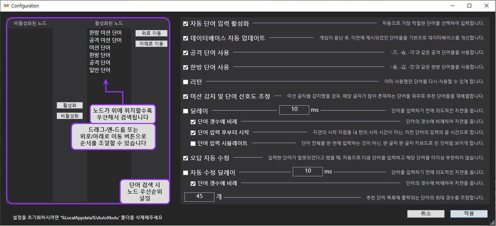

# AutoKkutu - KKutu-Helper 기반 끄투 단어 추천 및 자동 입력기
[](https://ci.appveyor.com/project/hsheric0210/autokkutu/branch/main)
[](https://github.com/hsheric0210/AutoKkutu/issues)


[](https://codeclimate.com/github/hsheric0210/AutoKkutu/maintainability)
[](https://sonarcloud.io/summary/new_code?id=hsheric0210_AutoKkutu)
[](https://sonarcloud.io/summary/new_code?id=hsheric0210_AutoKkutu)
[](https://sonarcloud.io/summary/new_code?id=hsheric0210_AutoKkutu)

AutoKkutu는 KKutu-Helper Release v5.6.8500버전을 개조하여 만들어졌습니다
(제작자가 리버싱 후 수정 허용함)

## 다운로드 / 설치 방법

* README 상단의 Build status 버튼 또는 [이 링크](https://ci.appveyor.com/project/hsheric0210/autokkutu/branch/main)을 클릭하여 AppVeyor CI에서 nightly 버전을 다운로드받으실 수 있습니다.
  * 상단의 AppVeyor 링크를 클릭하신 후, ```Artifacts```라는 버튼을 찾아 클릭합니다. 그러면 ```Windows.x64.Release.7z```라는 파일이 보일 것입니다. 이를 클릭하여 다운받으신 후 [반디집](https://kr.bandisoft.com/bandizip/), [7-zip](https://www.7-zip.org/download.html) 또는 [PeaZip](https://peazip.github.io/peazip-64bit.html) 등으로 압축을 풀고 사용하시면 됩니다.
* 사용중인 운영 체제에 맞는 버전(32비트 또는 64비트)를 다운로드 후, 압축을 풀고, AutoKkutu.exe 파일을 실행시키면 됩니다.
  * .NET Framework가 설치되어 있지 않을 경우, 이에 대한 설치 요구 메세지가 뜰 수 있습니다.

## 메인 창


## 설정 창


## 지원 기능

* 단어 자동 입력
  * 단어 입력 딜레이
    * 글자 수 비례 딜레이
    * 딜레이 시작 타이밍을 '나에게 턴이 돌아왔을 때'와 '마지막 단어를 입력한 이후' 둘 중에서 선택 가능
* '한방 단어 우선, 공격 단어 우선, 단어 길이 우선'과 같은 단어 검색 기준 설정 가능
* 입력되었던 단어 기반 데이터베이스 자동 업데이트 (새로운 단어 자동 추가, 존재하지 않는 단어 삭제) 기능
* 단어, 노드 일괄 추가, 파일로부터 추가, 이전 데이터베이스 파일 불러오기 기능

## 지원되는 게임 모드

* 끝말잇기
* 앞말잇기
* 가운뎃말잇기 (완벽하지 않음)
* 타자 대결
* 전체
* 자유
* 자유 끝말잇기

## 개발 언어

[](https://docs.microsoft.com/ko-kr/dotnet/)
[](https://docs.microsoft.com/ko-kr/dotnet/csharp/)

## 지원하는 데이터베이스 종류

* [](https://www.sqlite.org/index.html)
* [](https://www.postgresql.org/)
* [](https://www.mysql.com/)
  * [](https://mariadb.org/)

## 현재 (공식적으로) 지원되는 사이트

* [이름 없는 끄투](https://kkutu.org/)
* [핑크끄투](https://kkutu.pink/)
* [BF 끄투](https://bfkkutu.kr/)
* [끄투코리아](https://kkutu.co.kr/)
* [뮤직끄투](https://musickkutu.xyz/)
* <s>[끄투리오](https://kkutu.io)</s> - 안티 치트 바이패스 실패

## 아이콘 출처

* [Waiting](https://icons8.com/icon/4LVMPYVBsSXd/waiting) icon by [Icons8](https://icons8.com)
* [Search More](https://icons8.com/icon/102557/search-mor) icon by [Icons8](https://icons8.com)
* [Broom](https://icons8.com/icon/Xnx8cxDef16O/broom) icon by [Icons8](https://icons8.com)
* [error](https://icons8.com/icon/103174/error) icon by [Icons8](https://icons8.com)
* [Attack](https://icons8.com/icon/8fgdm3cVkheA/attack) icon by [Icons8](https://icons8.com)
* [Skull](https://icons8.com/icon/mIIa0TRNmD4k/skull) icon by [Icons8](https://icons8.com)
* [mission](https://icons8.com/icon/cjURgjzPYDlN/mission) icon by [Icons8](https://icons8.com)
* [Warning](https://icons8.com/icon/5tH5sHqq0t2q/warning) icon by [Icons8](https://icons8.com)

## 의존성 및 관련 프로젝트

* [CefSharp](https://github.com/cefsharp/CefSharp/) - .NET용 Chromium Embedded Framework 구현체
* [Npgsql](https://github.com/npgsql/npgsql) - .NET용 PostgreSQL 접속 및 데이터 제공 라이브러리
* [Serilog](https://github.com/serilog/serilog) - 현재 사용중인 .NET용 로깅 라이브러리
* [NLog](https://github.com/NLog/NLog) - 또 다른 .NET용 로깅 라이브러리
* [log4net](https://logging.apache.org/log4net/) - 또 또 다른 .NET용 로깅 라이브러리
* [MySqlConnector](https://github.com/mysql-net/MySqlConnector) - .NET용 MySQL 접속 및 데이터 제공 라이브러리
* [글자로 놀자! 끄투 온라인](https://github.com/jjoriping/kkutu)

## MySQL 또는 MariaDB 사용 시 주의사항

MySQL 또는 MariaDB 사용 시 데이터베이스의 Character Set과 Collation이 각각 ```utf8mb4```와 ```utf8mb4_general_ci```로 설정되었는지 확인해 주세요.

특히, 만약 사용 중이신 MySQL의 버전이 8.0.1 이상인 경우, Default Collation이 ```utf8mb4_0900_ai_ci```이기에, 반드시 Collation을 변경해 주셔야 합니다.
(```utf8mb4_0900_ai_ci```에 존재하는 치명적인 한글 처리 문제점은 [여기](https://rastalion.me/mysql-8-0-1-%EB%B2%84%EC%A0%84%EB%B6%80%ED%84%B0-%EC%B1%84%ED%83%9D%EB%90%9C-utf8mb4_0900_ai_ci%EC%9D%98-%ED%95%9C%EA%B8%80-%EC%82%AC%EC%9A%A9%EC%97%90-%EB%8C%80%ED%95%9C-%EB%AC%B8%EC%A0%9C%EC%A0%90/)에서 더 읽어보실 수 있습니다)

다음과 같은 명령으로 utf8 데이터베이스를 생성할 수 있습니다:

```sql
CREATE DATABASE <데이터베이스 이름> CHARACTER SET utf8mb4 COLLATE utf8mb4_general_ci;
```

또는 이미 존재하는 데이터베이스 및 테이블을 바꿀 수도 있습니다:

데이터베이스:

```sql
ALTER DATABASE <데이터베이스 이름> CHARACTER SET utf8mb4 COLLATE utf8mb4_general_ci;
```

테이블:
```sql
ALTER TABLE <데이터베이스 이름> CONVERT TO CHARACTER SET utf8mb4 COLLATE utf8mb4_general_ci;
```

이미 데이터베이스를 기본 설정으로 만드셨다면, 데이터베이스와 모든 테이블에 대하여 각각 캐릭터 셋을 바꿔 주셔야 합니다.

예시: 데이터베이스 이름이 'autokkutu'인 경우

```sql
ALTER DATABASE autokkutu CHARACTER SET utf8mb4 COLLATE utf8mb4_general_ci;
ALTER TABLE word_list CONVERT TO CHARACTER SET utf8mb4 COLLATE utf8mb4_general_ci;
ALTER TABLE attackword_list CONVERT TO CHARACTER SET utf8mb4 COLLATE utf8mb4_general_ci;
ALTER TABLE endword_list CONVERT TO CHARACTER SET utf8mb4 COLLATE utf8mb4_general_ci;
ALTER TABLE reverse_attackword_list CONVERT TO CHARACTER SET utf8mb4 COLLATE utf8mb4_general_ci;
ALTER TABLE reverse_endword_list CONVERT TO CHARACTER SET utf8mb4 COLLATE utf8mb4_general_ci;
ALTER TABLE kkutu_attackword_list CONVERT TO CHARACTER SET utf8mb4 COLLATE utf8mb4_general_ci;
ALTER TABLE kkutu_endword_list CONVERT TO CHARACTER SET utf8mb4 COLLATE utf8mb4_general_ci;
ALTER TABLE kkt_attackword_list CONVERT TO CHARACTER SET utf8mb4 COLLATE utf8mb4_general_ci;
ALTER TABLE kkt_endword_list CONVERT TO CHARACTER SET utf8mb4 COLLATE utf8mb4_general_ci;
```
