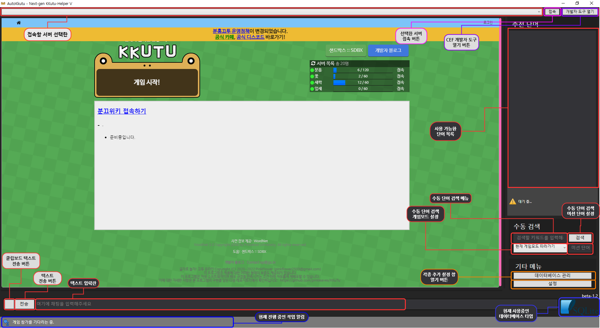
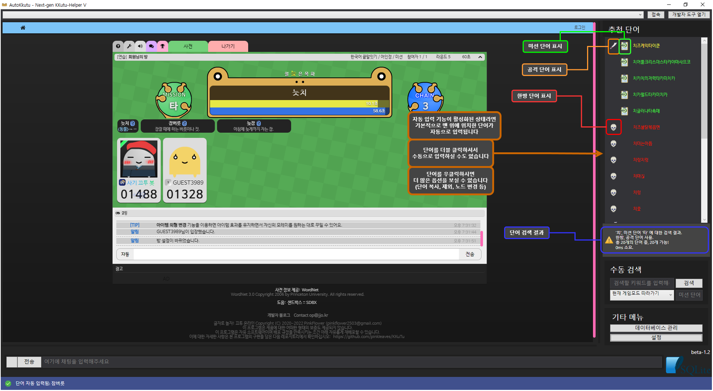

# AutoKkutu - KKutu-Helper 기반 끄투 단어 추천 및 자동 입력기
[](https://ci.appveyor.com/project/hsheric0210/autokkutu)
[](https://github.com/hsheric0210/AutoKkutu/issues)


[](https://codeclimate.com/github/hsheric0210/AutoKkutu/maintainability)
[](https://sonarcloud.io/summary/new_code?id=hsheric0210_AutoKkutu)
[](https://sonarcloud.io/summary/new_code?id=hsheric0210_AutoKkutu)
[](https://sonarcloud.io/summary/new_code?id=hsheric0210_AutoKkutu)

AutoKkutu는 끄투 헬퍼 V (KKutu-Helper V) Release v5.6.8500 버전을 개조하여 만들어졌습니다.
원 프로그램은 [여기](https://drive.google.com/file/d/1p_vTzLbkIPz-NBLuhEKTdK3ij55u7KNk/view?usp=sharing)에서, 글은 [여기](https://gall.dcinside.com/mgallery/board/view/?id=kkutu&no=395)에서 보실 수 있습니다.
(제작자가 리버싱 후 수정 허용함)

>현재 Selenium 버전 사용 시, 브라우저 창과 메인 GUI를 닫아도 프로그램이 종료되지 않는(콘솔 창이 꺼지지 않는) 문제가 있습니다.
>프로그램을 종료하시려면 콘솔 창에서 `Ctrl+C`나 `Ctrl+Break`를 눌러 종료해 주세요.

## 다운로드 / 설치 방법

* README 상단의 Build status 버튼 또는 [이 링크](https://ci.appveyor.com/project/hsheric0210/autokkutu/branch/main)을 클릭하여 AppVeyor CI에서 nightly 버전을 다운로드받으실 수 있습니다.
  * 상단의 AppVeyor 링크를 클릭하신 후, ```Artifacts```라는 버튼을 찾아 클릭합니다. 그러면 ```Windows.x64.Release.7z```라는 파일이 보일 것입니다. 이를 클릭하여 다운받으신 후 [반디집](https://kr.bandisoft.com/bandizip/), [7-zip](https://www.7-zip.org/download.html) 또는 [PeaZip](https://peazip.github.io/peazip-64bit.html) 등으로 압축을 풀고 사용하시면 됩니다.
* 사용중인 운영 체제에 맞는 버전(32비트 또는 64비트)를 다운로드 후, 압축을 풀고, AutoKkutuGui.exe 파일을 실행시키면 됩니다.
  * .NET Framework가 설치되어 있지 않을 경우, 이에 대한 설치 요구 메세지가 뜰 수 있습니다.

## 지원 기능

* 내 턴에 단어 자동 검색
  * 검색 시 **미션 단어** 자동 감지 및 단어 우선 순위 자동 조정
  * 단어의 종류가 '한방 단어', '공격 단어', '일반 단어'로 나뉘어 있으며, '한방 단어'와 '공격 단어'는 비활성화 가능
    * 이러한 '한방 단어', '공격 단어'는 각 게임 모드에 따라 모두 분리되어 있음 (예시: '기쁨'은 '끝말잇기' 모드에서는 한방 단어이나 '앞말잇기' 모드에서는 단어에서는 일반 단어임)
    * 이러한 단어의 종류는 특정 '노드'(끝말잇기에서는 끝 글자, 앞말잇기에서는 앞 글자 등등...)에 의해 관리됨. 즉, '듐'을 한방 노드로 등록시켜 놓고 데이터베이스 업데이트 시 '소듐', '라듐', '스칸듐' 등은 모두 한방 단어로 취급됨.

* 자동 입력: 검색된 단어 중 가장 최적의 것을 자동으로 입력
  * 단어 입력 시 일정 시간 지연(딜레이)
    * 글자 수에 비례한 딜레이
      * 만약 단어의 길이가 너무 길어 현재 남은 턴 시간 안에 입력을 마치지 못하고 게임 오버될 것이 예상되는 경우, 해당 단어는 입력 후보에서 자동으로 제외
    * 딜레이 시작 타이밍을 '나에게 턴이 돌아왔을 때'와 '마지막 단어를 입력한 이후' 둘 중에서 선택 가능

* 게임 종료 후 해당 게임에서 입력되었던 단어 이력을 기반으로 데이터베이스 자동 업데이트
  * 새로운 단어 자동으로 추가
  * 지원되지 않는 단어 자동으로 삭제
  * 새로운 한방 단어 노드 자동으로 추가

* 단어 및 노드 일괄 추가 기능
  * 파일로부터 추가, 폴더의 파일들로부터 추가 이전 데이터베이스 파일 불러오기 기능

* [CefSharp](https://github.com/cefsharp/CefSharp) 기반 임베디드 브라우저와 [Selenium](https://www.selenium.dev/) 기반 WebDriver 브라우저 모두 지원.
  * Selenium 사용 시, WebDriver 감지를 피하기 위해 [UndetectedChromeDriver](https://github.com/fysh711426/UndetectedChromeDriver) 사용

* 특수 단어(한방 단어, 공격 단어, 미션 단어 등) 강조 색상 사용자가 지정 가능

## 임베디드 브라우저(CefSharp 등) vs 웹 드라이버(Selenium 등)

### 임베디드 브라우저: CefSharp

1. :+1: 전반적인 자동 반응 속도가 빠릅니다.
2. :+1: 핸들러 코드가 비교적 최적화되어 있습니다.
3. :-1: 구글 로그인 시, 약간의 꼼수가 필요합니다. (User-Agent 변경)

### 웹 드라이버: Selenium + UndetectedChromeDriver

1. :+1: 사이트 움직임이 매우 부드럽다. 마치 실제로 Chrome에서 열고 게임하는 것처럼.
2. :+1: CefSharp와는 달리 구글 로그인 관련 문제가 없다.
3. :-1: 입력 뿐만이 아니라, 전반적인 사이트 자동 반응 속도가 CefSharp에 비해 느리다.
    (애초에 단일 소켓을 통해 브라우저와 통신하기에, 브라우저와 직접 통신 가능한 CefSharp보다 느릴 수 밖에 없음)
4. :-1: 핸들러가 자주 꼬인다. (표시된 단어 조건과 다른 단어를 찾아 입력하려고 한다던지...)

## 지원되는 게임 모드

* 끝말잇기
* 앞말잇기
* 가운뎃말잇기 (완벽하지 않음)
* 타자 대결
* 전체
* 자유
* 자유 끝말잇기

## UI 상 단축키 모음
* `Alt+A` - 자동 입력 토글
* `Alt+D` - 자동 입력 딜레이 토글
* `Alt+Shift+D` - 모든 종류의 입력 딜레이 토글 (입력 딜레이 + 자동 수정 딜레이)

## 개발 언어

[](https://docs.microsoft.com/ko-kr/dotnet/)
[](https://docs.microsoft.com/ko-kr/dotnet/csharp/)

## 지원하는 데이터베이스 종류

* [](https://www.sqlite.org/index.html)
* [](https://www.postgresql.org/)
* [](https://www.mysql.com/)
  * [](https://mariadb.org/)

## 현재 (공식적으로) 지원되는 사이트

* [이름 없는 끄투](https://kkutu.org/)
* [핑크끄투](https://kkutu.pink/)
* [BF 끄투](https://bfkkutu.kr/)
* [끄투코리아](https://kkutu.co.kr/) - 자동 입력 사용 시 단어 입력 방법을 '우회 미사용'으로 설정 시 'game_input' 검사에 의해 감지될 수 있습니다. (참고: https://gitlab.com/-/snippets/2548135)
* [뮤직끄투](https://musickkutu.xyz/)
* [끄투리오](https://kkutu.io) - 자동 입력 사용 시 단어 입력 방법을 반드시 '입력 시뮬레이션, Win32 메시지 기반'으로 설정하실 것을 추천합니다. (참고: https://gitlab.com/-/snippets/2554781)

## 프로그램 실행 모습

### 메인 창





### 설정 창


## 아이콘 출처

* [Waiting](https://icons8.com/icon/4LVMPYVBsSXd/waiting) icon by [Icons8](https://icons8.com)
* [Search More](https://icons8.com/icon/102557/search-mor) icon by [Icons8](https://icons8.com)
* [Broom](https://icons8.com/icon/Xnx8cxDef16O/broom) icon by [Icons8](https://icons8.com)
* [error](https://icons8.com/icon/103174/error) icon by [Icons8](https://icons8.com)
* [Attack](https://icons8.com/icon/8fgdm3cVkheA/attack) icon by [Icons8](https://icons8.com)
* [Skull](https://icons8.com/icon/mIIa0TRNmD4k/skull) icon by [Icons8](https://icons8.com)
* [mission](https://icons8.com/icon/cjURgjzPYDlN/mission) icon by [Icons8](https://icons8.com)
* [Warning](https://icons8.com/icon/5tH5sHqq0t2q/warning) icon by [Icons8](https://icons8.com)

## 의존성 및 관련 프로젝트

* [CefSharp](https://github.com/cefsharp/CefSharp/) - .NET용 Chromium Embedded Framework 구현체
* [Npgsql](https://github.com/npgsql/npgsql) - .NET용 PostgreSQL 접속 및 데이터 제공 라이브러리
* [Serilog](https://github.com/serilog/serilog) - 현재 사용중인 .NET용 로깅 라이브러리
* [NLog](https://github.com/NLog/NLog) - 또 다른 .NET용 로깅 라이브러리
* [log4net](https://logging.apache.org/log4net/) - 또 또 다른 .NET용 로깅 라이브러리
* [MySqlConnector](https://github.com/mysql-net/MySqlConnector) - .NET용 MySQL 접속 및 데이터 제공 라이브러리
* [글자로 놀자! 끄투 온라인](https://github.com/jjoriping/kkutu)

## MySQL 또는 MariaDB 사용 시 주의사항

MySQL 또는 MariaDB 사용 시 데이터베이스의 Character Set과 Collation이 각각 ```utf8mb4```와 ```utf8mb4_general_ci```로 설정되었는지 확인해 주세요.

특히, 만약 사용 중이신 MySQL의 버전이 8.0.1 이상인 경우, Default Collation이 ```utf8mb4_0900_ai_ci```이기에, 반드시 Collation을 변경해 주셔야 합니다.
(```utf8mb4_0900_ai_ci```에 존재하는 치명적인 한글 처리 문제점은 [여기](https://rastalion.me/mysql-8-0-1-%EB%B2%84%EC%A0%84%EB%B6%80%ED%84%B0-%EC%B1%84%ED%83%9D%EB%90%9C-utf8mb4_0900_ai_ci%EC%9D%98-%ED%95%9C%EA%B8%80-%EC%82%AC%EC%9A%A9%EC%97%90-%EB%8C%80%ED%95%9C-%EB%AC%B8%EC%A0%9C%EC%A0%90/)에서 더 읽어보실 수 있습니다)

다음과 같은 명령으로 utf8 데이터베이스를 생성할 수 있습니다:

```sql
CREATE DATABASE <데이터베이스 이름> CHARACTER SET utf8mb4 COLLATE utf8mb4_general_ci;
```

또는 이미 존재하는 데이터베이스 및 테이블을 바꿀 수도 있습니다:

데이터베이스:

```sql
ALTER DATABASE <데이터베이스 이름> CHARACTER SET utf8mb4 COLLATE utf8mb4_general_ci;
```

테이블:
```sql
ALTER TABLE <데이터베이스 이름> CONVERT TO CHARACTER SET utf8mb4 COLLATE utf8mb4_general_ci;
```

이미 데이터베이스를 기본 설정으로 만드셨다면, 데이터베이스와 모든 테이블에 대하여 각각 캐릭터 셋을 바꿔 주셔야 합니다.

예시: 데이터베이스 이름이 'autokkutu'인 경우

```sql
ALTER DATABASE autokkutu CHARACTER SET utf8mb4 COLLATE utf8mb4_general_ci;
ALTER TABLE word_list CONVERT TO CHARACTER SET utf8mb4 COLLATE utf8mb4_general_ci;
ALTER TABLE attackword_list CONVERT TO CHARACTER SET utf8mb4 COLLATE utf8mb4_general_ci;
ALTER TABLE endword_list CONVERT TO CHARACTER SET utf8mb4 COLLATE utf8mb4_general_ci;
ALTER TABLE reverse_attackword_list CONVERT TO CHARACTER SET utf8mb4 COLLATE utf8mb4_general_ci;
ALTER TABLE reverse_endword_list CONVERT TO CHARACTER SET utf8mb4 COLLATE utf8mb4_general_ci;
ALTER TABLE kkutu_attackword_list CONVERT TO CHARACTER SET utf8mb4 COLLATE utf8mb4_general_ci;
ALTER TABLE kkutu_endword_list CONVERT TO CHARACTER SET utf8mb4 COLLATE utf8mb4_general_ci;
ALTER TABLE kkt_attackword_list CONVERT TO CHARACTER SET utf8mb4 COLLATE utf8mb4_general_ci;
ALTER TABLE kkt_endword_list CONVERT TO CHARACTER SET utf8mb4 COLLATE utf8mb4_general_ci;
```

## 관련 레포지토리

* [univdev/Kkutu-helper](https://github.com/univdev/Kkutu-helper)
